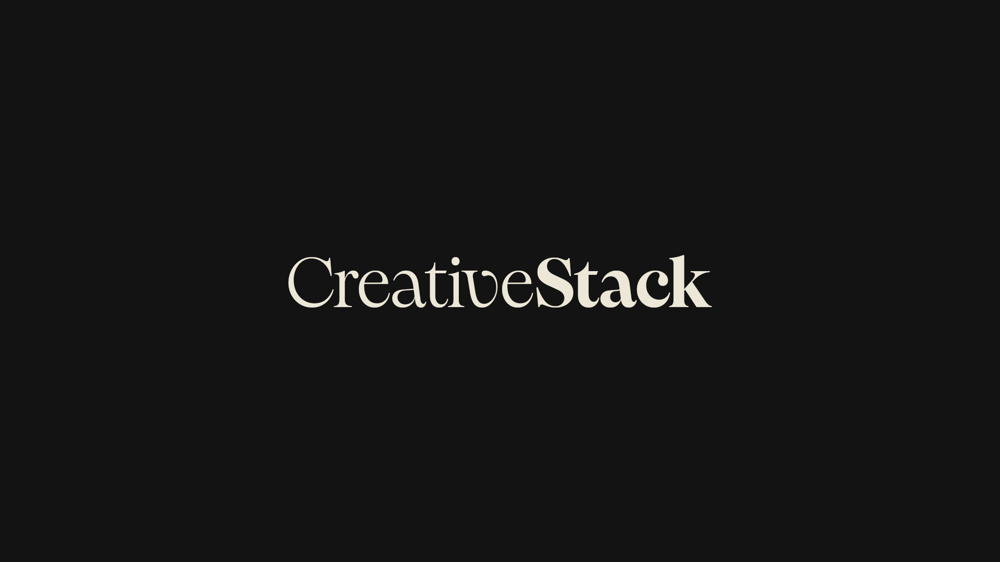

<p align="center">
  
</p>

# CreativeStack

**A Claude Code skill suite for creative agencies, studios, freelancers, in-house teams, and creative companies.** 29 brain-first skills and 4 workflow agents that handle the operational and analytical work around creative projects - research, briefs, strategy, pitches, copy decks, retros, profitability, resourcing - without ever generating creative output.

The creative step stays human. Everything around it is what CreativeStack does for you.

---

## What this is for

Most creative work isn't the work itself - it's the gathering, structuring, briefing, scoping, scheduling, pitching, debriefing, and case-studying that surrounds the work. CreativeStack does that work, and gets sharper at it the more you use it.

The skills are designed around three principles:

1. **Brain-first.** Every skill reads from a persistent Context Vault at `~/.creativestack/` (your "brain") that you build up over time. Five projects in, the skills know your team, your rates, your tone of voice, your methodology, your past pitch outcomes, your client communication patterns, your portfolio, and your category intelligence. Every run is sharper than the last.
2. **Compounding.** Every skill writes back to the brain when something useful surfaces - a new client vocabulary term, a refined pricing pattern, a recurring feedback archetype, a category code. Three runs in and the brain catches things only an experienced senior would.
3. **Creative-industry-specific.** This isn't a generic productivity suite. Every skill is built around problems that exist in creative work specifically - revision rounds, pitch archetypes, brief tensions, single-minded thoughts, category codes, conflict-of-interest checks, brand voice vs agency voice, the things that make creative practice creative.

## Who it's for

- **Creative agencies** - full-service, branding, digital, design, advertising, content
- **Studios** - small creative practices (2-10 people)
- **Freelancers** - solo creative professionals
- **In-house teams** - creative teams inside larger organisations
- **Creative companies** - production houses, design consultancies, type foundries

The skills adapt their language and flow based on what you are. A freelancer doesn't need the team-resource skills. An in-house team doesn't need the proposal generator. The setup skill captures who you are once and every other skill respects it.

---

## Installation

Open your terminal app (Terminal on macOS, Windows Terminal or PowerShell on Windows, your usual terminal on Linux), paste the three lines below, and hit enter. They download CreativeStack into Claude Code's skills folder and run the installer that wires everything up. Takes about 30 seconds.

```bash
git clone https://github.com/camawjones/creativestack.git ~/.claude/skills/creativestack
cd ~/.claude/skills/creativestack
./create
```

`./create` symlinks each skill's `SKILL.md` into `~/.claude/skills/<name>/SKILL.md` and each workflow agent into `~/.claude/agents/<name>.md`, so Claude Code discovers them as flat top-level entries. Restart Claude Code and all 29 skills and 4 agents are available — invoked flat as `/creative-brief`, `/meeting-notes`, `/competitor-audit`, and so on.

### Updates

```bash
cd ~/.claude/skills/creativestack && git pull && ./create
```

Re-running `./create` after a `git pull` is safe and idempotent — it refreshes existing symlinks and adds any new skills.

### Uninstall

```bash
cd ~/.claude/skills/creativestack && ./create --uninstall
```

Only removes symlinks that point back into the creativestack repo — anything else in `~/.claude/skills/` or `~/.claude/agents/` is left alone.

### Optional: SessionStart hook

If you want a brain-status line at the start of every Claude Code session, add this to `~/.claude/settings.json`:

```json
{
  "hooks": {
    "SessionStart": [
      { "hooks": [{ "type": "command", "command": "bash $HOME/.claude/skills/creativestack/scripts/check-brain.sh" }] }
    ]
  }
}
```

Skip this and everything still works — each skill does its own brain-freshness checks.

---

## Quick start

**1. Set up your brain (5 minutes - optional but transformative)**

```
/setup-brain
```

This is an onboarding flow, not an installer — the skills are already installed by the `git clone`. `/setup-brain` walks you through who you are, your team, your tone of voice, and your standard methodology, and creates your Context Vault at `~/.creativestack/`. Every other skill reads from this vault and gets sharper because of it.

You can skip this entirely and use any skill immediately — they'll work, just generically.

**2. Try a skill on real work**

Pick whichever maps to what you're doing right now:

```
/meeting-notes              # paste a transcript, get structured notes + brain cross-reference
/creative-brief             # turn messy intake into a proper brief with tension + SMT + 10-dim score
/competitor-audit           # category audit with conflict-of-interest check
/case-study                 # auto-extract a case study from project state, no manual gathering
/project-profitability      # margin analysis with rate card and scenario modelling
```

**3. Try a workflow agent for end-to-end flows**

```
@pitch-prep              # research → competitor audit → pitch dossier → brief → proposal
@project-setup           # brief → timeline → SOW → resource check → kickoff pack
@delivery-review         # timesheet → profitability → retro → case study
@research-deep-dive      # source-scrape → competitor/trend → design-research/strategy
```

**4. Watch the brain compound**

After three or four runs, look at `~/.creativestack/` - you'll see persistent files growing: project state files, prospect dossiers, case studies, learnings sections, pricing patterns, client vocabulary. Each one makes the next skill run sharper.

---

## The Context Vault (your brain)

Every CreativeStack skill reads from and (with permission) writes to `~/.creativestack/`. This is where the suite's compound value lives.

### Foundation files

Created by `/setup-brain` - the baseline:

| File | What it holds |
|---|---|
| `profile.md` | Who you are: type (freelancer / studio / agency / in-house / company), name, location, specialisms |
| `tone-of-voice.md` | How you sound - register, do/don't, vocabulary, examples |
| `methodology.md` | How you run projects (e.g. Discover → Define → Design → Deliver) |
| `team.md` | Team roster with optional fields: seniority, day rate, contracted hours, specialisms, can_substitute_for, leave patterns |
| `clients.md` | Active and past clients with relationship context |
| `case-studies.md` | Portfolio index - read by every skill that needs to reference past work |

### Compounding files

Created by individual skills as you use them. These are where the brain gets sharper:

| File | Created by | What it accumulates |
|---|---|---|
| `rate-card.md` | `project-profitability` Setup rates | Internal cost rates + billing rates by role and person |
| `freelance-bench.md` | `resource-conflict` Setup bench | Trusted freelance roster with rates, lead times, ratings |
| `sow-style.md` | `sow-generator` Setup mode | Your SOW format - section order, voice, default clauses, payment terms |
| `learnings.md § Capacity` | `resource-conflict` Calibrate | Planned-vs-actual capacity deltas, hidden meeting load, team rhythms |
| `learnings.md § Profitability` | `project-profitability` | Margin patterns and lessons across projects |
| `learnings.md § Pitching` | `pitch-research` Log outcome | Win/loss patterns by sector and project type |
| `learnings.md § Feedback` | `feedback-consolidator` | Per-client vocabulary, archetypes, stakeholder memory |
| `learnings.md § Client Patterns` | `meeting-notes` | Per-stakeholder communication patterns ("Marcus says X to mean Y") |
| `prospects/_index.md` + `prospects/{slug}.md` | `pitch-research` | Persistent prospect dossiers with research, decision-makers, killer hooks, outreach log |
| `competitor-audits/{category}.md` | `competitor-audit` | Versioned per-category competitive intelligence |
| `case-studies/{slug}.md` | `case-study` | Full per-project case studies with multi-length output and approval packages |
| `projects/_index.md` + `projects/{slug}.md` | `creative-brief`, `project-kickoff`, others | Per-project state: status, decisions, risks, engagement health |
| `projects/{slug}-brief.md` | `creative-brief` | The locked-at-kickoff creative brief with tension, SMT, audience, success criteria |
| `projects/{slug}-meetings.md` | `meeting-notes` | Append-only meeting log with sentiment scores per meeting |
| `projects/{slug}-copy-deck-v*.md` | `copy-deck` | Versioned copy decks with atom-level scoring |

### Brain freshness

Every skill checks the freshness of the brain files it reads. If anything is stale (per-file thresholds: `team.md` 90d, `rate-card.md` 180d, `learnings.md` 60d, etc.) you get a single-line nudge at the end of the output suggesting which skill to run to refresh it. Non-disruptive, never blocks work.

### Privacy

Your brain lives **only on your machine** at `~/.creativestack/`. Nothing in this directory is ever uploaded, transmitted, or shared with anyone. CreativeStack reads and writes these files locally; everything in the brain is yours.

---

## Making it yours

CreativeStack is designed to fit your agency, not the other way around. There are two ways to customise it.

### 1. Configure via the brain (recommended for everyone)

The Context Vault at `~/.creativestack/` **is** the customisation layer. Every skill reads from it and adapts to what you've put there. You don't need to edit the skill templates themselves - you populate your brain and the skills respect it automatically.

Things that change when you populate the brain:
- **Voice and writing style** - every client-facing output matches your `tone-of-voice.md`
- **Methodology and phase names** - briefs, timelines, and case studies structure around the phases in your `methodology.md`
- **Pricing and fee logic** - every profitability and proposal skill anchors to your `rate-card.md` and past project history
- **Team language and substitution rules** - resource and timeline skills use your `team.md` with seniority, rates, and can_substitute_for fields
- **Client-specific vocabulary and archetypes** - feedback, copy, and brief skills apply per-client translations saved to `learnings.md § Feedback`
- **SOW format and standard clauses** - `sow-generator` learns your format once via `sow-style.md` and reuses it forever

Three to five runs in and the skills produce output that's specific to your agency in a way no generic AI tool can match - because the brain knows your team, your rates, your tone, your methodology, your past pitch outcomes, and your client communication patterns.

**Most users never need to go beyond this.** Populate the brain, run skills on real work, accept the compounding loop offers as they surface - the suite gets sharper with every project.

### 2. Fork and edit the skill templates (for deeper changes)

If you want to change skill **behaviour** - rename sections, add custom modes, remove sections you don't use, add agency-specific language to the shared preamble, write new reference files - fork the repo and edit the templates.

```bash
git clone https://github.com/your-fork/creativestack.git ~/.claude/skills/creativestack
cd ~/.claude/skills/creativestack
./create
# Edit _build/templates/{skill}/SKILL.md.tmpl or _build/shared/preamble.md
bash _build/build-skills.sh
```

See [CLAUDE.md](./CLAUDE.md) for the build system, template conventions, and contributing back upstream if your change would help others.

**Suggested fork-worthy changes:**
- Adding your agency's name to outputs or reference files
- Removing skills you genuinely don't use (freelancers can drop `resource-conflict`, in-house teams can drop `proposal-generator` and `sow-generator`)
- Adding custom modes to existing skills for workflows unique to your practice
- Adding new reference files to existing skills (e.g. your own clause library, your own archetype list, your own award submission formats)
- Translating skill prompts into another language

Things to avoid forking for:
- Adding client-specific details (use the brain)
- Changing the tone of output (use `tone-of-voice.md`)
- Changing fee defaults (use `rate-card.md`)
- Adding methodology steps (use `methodology.md`)

These all live in the brain precisely so you don't have to touch the skill templates for them.

---

## Skills

29 skills organised by what you're trying to do. Most have multiple **modes** - different flows for different situations within the same skill.

### Setup & maintenance

| Skill | What it does |
|---|---|
| `/setup-brain` | Initialise or refresh your brain - profile, tone of voice, team, clients, methodology |
| `/update-voice` | Refine your tone-of-voice guidelines with examples and do/don't rules |

### Daily operations

| Skill | What it does |
|---|---|
| `/meeting-notes` | **3 modes** - Notes (transcript + brain cross-reference panel surfacing what no recording tool can see), Pre-meeting (1-page brief from project state, no transcript needed), Patterns (sentiment trajectory + recurring scope items + action completion across meetings) |
| `/status-update` | Multi-audience project updates (client / leadership / creative team / Slack) with sentiment trajectory from the meeting log |
| `/copy-deck` | **3 modes** - Deck (messy input → atom-level scored copy deck with brand voice from the brief), Check (audit existing copy without rewriting), Microcopy (UX microcopy patterns for buttons/errors/empty states/loading/success/forms) |
| `/feedback-consolidator` | **3 modes** - Translate (vague feedback → creative direction using client vocabulary), Consolidate (multi-round → deduplicated action list with 8-archetype detection and priced rounds), Respond (draft client reply in agency tone) |

### Project kickoff

| Skill | What it does |
|---|---|
| `/creative-brief` | **3 modes** - From inputs (messy content → structured brief), From scratch (blank-page interview), From pitch (auto-populate from a won prospect dossier). Industry-standard structure with tension, real objective, 4-layer audience, insight, single-minded thought. 10-dimension rubric blocks weak briefs from going to the team. Creates project state files. |
| `/brief-sharpener` | **4 modes** - Audit, Triage, Question-ladder, Re-write. Pressure-tests existing briefs against client patterns and red flag library |
| `/timeline-generator` | Project scope → realistic timeline with critical path, slip scenarios, freelance backstops, optional Figma/Mermaid output |
| `/project-kickoff` | Project type → roles, RACI, kickoff pack, risk register |
| `/sow-generator` | **5 modes** - Setup style (learns your SOW format once), Ingest (extract style from a pasted SOW), Generate (60-second SOWs in your saved format), Manage clauses, Edit style |

### Strategic & creative

| Skill | What it does |
|---|---|
| `/creative-strategy` | Brief → cultural research, competitor analysis, strategic territories, structured provocations |
| `/design-research` | **6 modes**: visual / landscape / brands / trends / evidence / people. Cultural references, themed research boards, dual audience output, optional FigJam export |
| `/trend-report` | Category → trend report with velocity scoring, counter-trends, brand examples |

### Business development

| Skill | What it does |
|---|---|
| `/pitch-research` | **4 modes** - Research (deep prospect dossier with fit score, decision-maker profiles, killer hook, warm path in), Refresh (update an existing dossier), Pitch prep (1-page in-the-room brief), Log outcome (win/loss capture that compounds via `learnings.md § Pitching`) |
| `/competitor-audit` | **2 modes** - Audit (full category landscape with mandatory conflict-of-interest check against `clients.md`, scoring on 5 rubrics, category codes analysis, agency attribution, 10 vulnerability archetypes), Shift (diff against previously-saved audit to surface what's changed). Persistent category intelligence in `competitor-audits/{category}.md` |
| `/case-study` | **3 modes** - Write (auto-extracts material from `projects/{slug}-brief.md`, meeting log, copy decks, post-mortem; solves the "gathering" pain), Awards (craft-focused for award submissions), Update (add new results/awards/press without rewriting). Multi-length output (1-line / 1-paragraph / 1-page / long-form), client approval package with draft email |
| `/rfi-response` | RFI/EOI → drafted responses pulled from existing case studies, bios, methodology |
| `/proposal-generator` | Brief or RFP → structured proposal with pre-flight gut check, brain-anchored pricing, pitch learnings overlay, optional Figma layout |

### Document production

| Skill | What it does |
|---|---|
| `/asset-spec` | Campaign concept → full deliverable specification (dimensions, formats, platform requirements, naming, version control, handoff checklists) |
| `/brand-guidelines` | Scattered brand assets → structured brand guidelines with completeness scoring and gap identification |
| `/social-calendar` | Brand voice + campaigns → content calendar grounded in the brief's tone and approved copy decks |

### Research & intelligence

| Skill | What it does |
|---|---|
| `/source-scrape` | Browse-powered research utility called by other skills. Hits curated creative industry sources with formal modes (visual, brands, trends, landscape, evidence, people) and returns structured evidence |

### Financial

| Skill | What it does |
|---|---|
| `/project-profitability` | **4 modes** - Analyse (project or retainer with margin, scenarios, benchmarks), Setup rates (build a reusable rate card), Aggregate (cross-project patterns by client/type/team/trend), Backfill (bootstrap project history) |
| `/timesheet-summary` | Raw time data → narrative project health report with burn projections, revision tax, scope creep, planned-vs-actual |

### People & resources

| Skill | What it does |
|---|---|
| `/resource-conflict` | **5 modes** - Analyse (find conflicts, score creative quality risk, recommend specific moves), Setup team (enrich `team.md` with seniority/rates/substitutability), Setup bench (build trusted freelance roster), Scenario (model pitch wins, person leaves, new projects), Calibrate (capture planned-vs-actual to compound future runs) |
| `/job-description` | Vague role brief → inclusive, well-structured creative job description |

### Knowledge & retros

| Skill | What it does |
|---|---|
| `/post-mortem` | Project state files (brief, meetings, copy decks, profitability) → structured retrospective with categorised learnings written back to `learnings.md`, client notes to `clients.md`, process changes to `methodology.md` |

### Audits & assessments

| Skill | What it does |
|---|---|
| `/ai-audit` | **4 modes** - Quick / Deep / Targeted / Refresh. Interactive AI-readiness assessment for creative practices, scored across 5 maturity dimensions with prioritised quick wins |

---

## Workflow agents

Agents chain multiple skills together for end-to-end workflows. Use the `@agent-name` syntax in Claude Code, or invoke from Cowork.

| Agent | What it does | Skills chained |
|---|---|---|
| `@pitch-prep` | Full pitch preparation from research to proposal | `source-scrape` → `competitor-audit` → `pitch-research` → `creative-brief` → `proposal-generator` |
| `@project-setup` | Brief to kickoff pack in one flow | `brief-sharpener` → `timeline-generator` → `sow-generator` → `resource-conflict` → `project-kickoff` |
| `@delivery-review` | End-of-project retro with profitability and case study | `timesheet-summary` → `project-profitability` → `post-mortem` → `case-study` |
| `@research-deep-dive` | Comprehensive research foundation | `source-scrape` → `competitor-audit` / `trend-report` → `design-research` / `creative-strategy` |

---

## MCP integrations

Skills detect available MCP servers and unlock additional capabilities. Everything works without MCPs - these are optional enhancements.

| MCP server | Skills enhanced | What it adds |
|---|---|---|
| **Figma** | `timeline-generator`, `design-research`, `brand-guidelines`, `proposal-generator` | Visual timeline output, FigJam research boards, designed brand guidelines, presentable proposals |
| **Google Calendar** | `meeting-notes`, `resource-conflict`, `project-kickoff` | Pull attendee lists and agendas, check team availability and leave, schedule kickoff events |
| **Gmail** | `meeting-notes`, `feedback-consolidator`, `pitch-research` | Pull meeting context and feedback from email threads |
| **Slack** | `project-kickoff`, `status-update`, `trend-report`, `timesheet-summary` | Post announcements, share updates, distribute reports |
| **Notion** | `meeting-notes`, `post-mortem`, `social-calendar` | Save notes, retros, and content calendars to your Notion workspace |

---

## How a typical skill works

Most refactored skills follow the same brain-first pattern:

1. **Brain check** - read the relevant brain files for this skill (and only those)
2. **Mode selection** - pick from 2-5 modes with different flows
3. **Upstream check** - pull data from other CreativeStack skills run earlier in the same session
4. **Brain context loading** - apply per-client vocabulary, past pitch learnings, methodology framing, etc.
5. **Generate** - produce the output, citing the brain sources used
6. **Write back** - persist new findings to the brain (versioned where appropriate)
7. **Compounding loop** - offer at most one brain enrichment based on what was missing or what was learned
8. **Brain freshness check** - single-line nudge if any read brain files are stale

The output is **specific to your agency** in a way generic AI tools can't be - because the brain knows your team, your rates, your tone, your methodology, your past projects, your client communication patterns, and your pitch history.

---

## Project structure

For contributors. Read [CLAUDE.md](./CLAUDE.md) for the build system and editing conventions.

```
creativestack/
├── _build/
│   ├── build-skills.sh             # Build script - generates skills/* from templates
│   ├── shared/
│   │   ├── preamble.md             # Shared header included in every skill (brain discovery, freshness check, voice rules)
│   │   ├── project-state.md        # Project state discovery + write protocol
│   │   └── user-types.md           # User type adaptation reference
│   └── templates/
│       └── {skill-name}/
│           ├── SKILL.md.tmpl       # Skill template - edit these
│           └── references/         # Per-skill reference files loaded on demand
├── skills/                         # Generated SKILL.md files - DO NOT edit directly
├── agents/                         # Workflow agent definitions (Markdown with YAML frontmatter)
├── CLAUDE.md                       # Project instructions for editing CreativeStack
└── LICENSE                         # MIT
```

### Building locally

After editing any `.tmpl` file or `_build/shared/` content:

```bash
bash _build/build-skills.sh
```

This regenerates all `skills/*/SKILL.md` files. Commit both the `.tmpl` source and the generated `.md` output.

---

## Philosophy

CreativeStack is built on a few firm beliefs:

1. **The creative leap stays human.** No skill in this suite generates creative work - no headlines, no concepts, no design directions, no manifestos. The skills handle research, structure, scoring, scoping, and synthesis. The actual creative move is yours. Always.
2. **Generic AI is worse than no AI for creative work.** Generic prompts produce generic output that erodes craft. CreativeStack is the opposite - every skill is grounded in the agency's own brain, and the skills are specifically engineered around the way creative practice works.
3. **Tools should compound.** A good tool gets better the more you use it. The brain-first architecture means that's literally how this works - three runs in, the suite knows things about your agency that no one outside it could.
4. **Honesty over polish.** The skills surface hard truths: this brief has no tension, this client's feedback is the Committee archetype, this pitch lost because of scale and you're about to make the same mistake, this case study has weak metrics and shouldn't be published. Politeness is fine; flattery isn't useful.
5. **Time given back goes to the work.** The point of automating the operational layer isn't to ship more - it's to free up the time and attention that should go to the actual creative thinking.

---

## About

Built by **me, Cam** - AI partner for creative agencies, studios, and creative companies.

I build custom AI workflows, embedded tooling, and AI strategy for creative practices. If you want CreativeStack tailored to your agency, or you need a deeper AI partnership beyond the stack, get in touch:

**[jones.cam](https://jones.cam)**

---

## Contributing

CreativeStack is open source under the MIT license. Contributions, issues, and skill suggestions are welcome at [github.com/camawjones/creativestack](https://github.com/camawjones/creativestack).

If you build a new skill or improve an existing one, follow the patterns in [CLAUDE.md](./CLAUDE.md) and submit a pull request. Every accepted contribution gets credit in the repo.

## License

MIT - see [LICENSE](./LICENSE).
